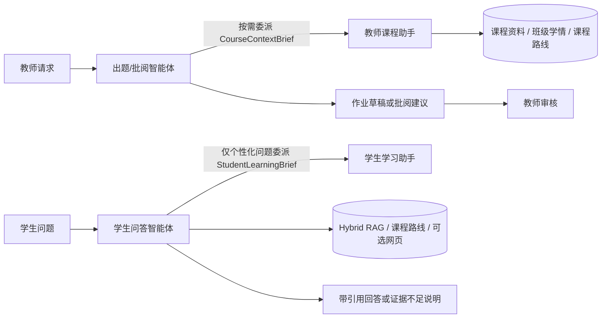

# AIedu Agentic Learning Platform

AIedu 是一个面向高校课程的、可审计的四智能体协作学习平台。项目不是把每个功能都包装成 Agent，而是在现有 FastAPI、Vue 2、MySQL、Redis、RocketMQ、Qdrant 和 MinIO 业务系统上，加入四个边界清晰的业务智能体。

## 四个智能体

| 智能体 | 负责 | 不负责 |
|---|---|---|
| 教师课程助手 | 课程资料、班级学情、课程知识路线 | 出题、评分、发布 |
| 教师出题/批阅智能体 | 作业草稿、Rubric、评分建议、Reflection | 自动发布、自动确认成绩 |
| 学生学习助手 | 画像解释、诊断/巩固练习、学习建议 | 修改掌握度或分数 |
| 学生问答智能体 | Agentic RAG、资料引用、作业防抄、网页信息 | 无证据编造、直接代写开放作业 |

只有两条跨智能体委派：出题智能体 → 教师课程助手，学生问答智能体 → 学生学习助手。每次运行最多 4 个计划步骤、6 次工具调用和 1 次 Reflection；运行计划、工具、委派、校验、耗时和 token 使用都会进入 `agent_runs` / `agent_run_steps`。



## 面试可讲的工程点

- LangGraph 公共运行状态：`prepare_context → make_plan → execute_tools → compose_result → validate_result → reflect_once? → finalize`。
- Pydantic 结构化输出；OpenAI-compatible 网关不支持严格 schema 时，JSON 提示 + 校验 + 一次修复。
- PDF、DOCX、PPTX 保留页码/幻灯片/标题层级的结构化切片。
- Qdrant Dense Top-20 + MySQL BM25 Top-20 + RRF + 可降级本地 `bge-reranker-base`。
- 课程路线先生成草稿、校验证据、教师发布，再同步为业务知识点。
- 工作记忆、会话摘要、确定性学情语义记忆、反馈记忆和提示词版本分层。
- AI 不能直接发布作业或确认成绩；低置信批阅进入人工复核。

更完整的边界与数据流见 [架构说明](docs/ARCHITECTURE.md)，可重复演示流程见 [演示脚本](docs/DEMO.md)。

## 本地运行

1. 复制 `.env.example` 和 `.env.ai.example`，只在本地文件中填写密钥。
2. 启动基础设施：`docker compose up -d mysql redis minio qdrant rocketmq-namesrv rocketmq-broker`。
3. 后端：

   ```powershell
   cd "Aiedu-student-study FastAPI后端"
   uv sync --extra dev
   uv run alembic upgrade head
   uv run uvicorn app.main:app --port 9091
   ```

4. 另开终端启动 Worker：`uv run python -m app.worker`。
5. 前端：进入 `Aiedu-student-study 前端` 后运行 `npm ci`、`npm run serve`。

本地 reranker 默认关闭，生产使用 RRF 结果。需要复现实验时执行 `uv sync --extra reranker` 并设置 `AIEDU_ENABLE_LOCAL_RERANKER=true`；显存不足会回退 CPU，加载失败不会阻断问答。

## 验证

```powershell
cd "Aiedu-student-study FastAPI后端"
$env:PYTHONPATH='.'
.\.venv\Scripts\python.exe -m pytest -q

cd "..\Aiedu-student-study 前端"
npm run build
```

## 可复现评测

项目内置 RAG、智能批阅 Reflection、结构化意图路由三组消融评测。统一入口：

```powershell
cd "Aiedu-student-study FastAPI后端"
uv run python -m scripts.evaluate_agents --suite all --dataset-version v2 --offering-id 2
```

评测会保存逐样本 JSON、Markdown 汇总、失败案例、Token 和延迟。正式运行要求全部样本经过审核，且指定 Rerank 时必须真正加载模型，禁止静默降级后伪报重排结果。结构化切片后的 v2 中，章节类 Hybrid nDCG@5 从 v1 的 0.5419 提升到 0.7827；reranker 将 v2 整体 nDCG@5 从 0.7033 提升到 0.7814，但 CPU warm p95 增加 5.85 秒、端到端 12 组对比没有获胜，因此生产仍默认使用 RRF。路由与批阅沿用 v1 正式结论。详见 [评测说明](docs/evaluation.md)、[v2 审核记录](docs/evaluation-dataset-audit-v2.md)与 [RAG v2 正式结果](docs/evaluation-results-v2.md)。

## 已知边界

- 不处理扫描 PDF OCR、课件图片语义或复杂多模态内容。
- 不使用 Neo4j；课程路线采用 MySQL 版本化节点/边，便于审核与发布。
- 不允许智能体自由循环或互相无限对话。
- 网页搜索只有配置 Tavily-compatible 密钥后才开放，网页文本始终视为不可信证据。
- 当前 Vue 2 构建仍有历史大资源包告警，不影响生产构建成功。
