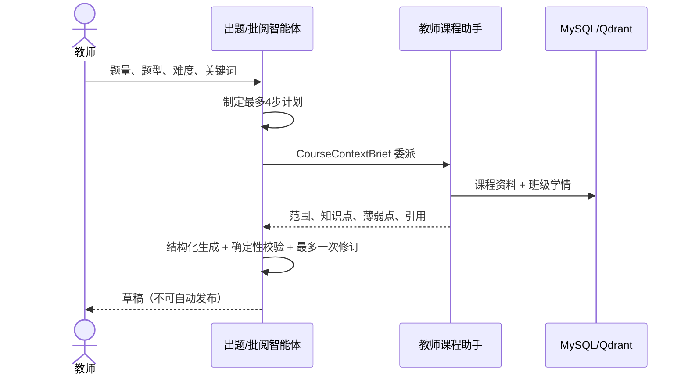
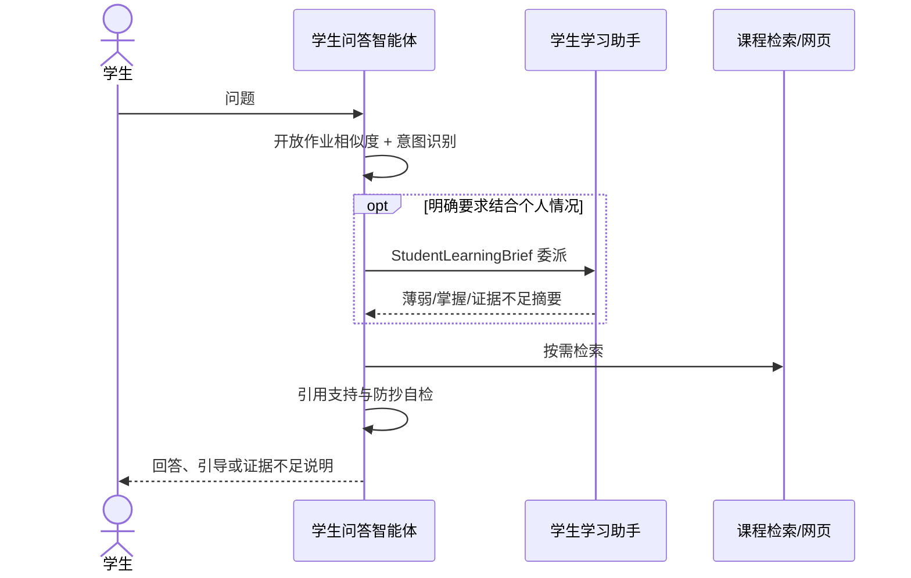

# 四智能体架构与可靠性边界

## 请求路由

API 根据角色和业务入口直接选择业务智能体，不额外消耗一次 LLM 进行“总管路由”。智能体可以选择白名单工具，但不能绕过课程归属、角色权限或人工确认。

## RAG 数据流

1. Worker 从 MinIO 读取原文件。
2. PDF 按页、DOCX 按标题/正文/列表/表格、PPTX 按幻灯片/标题/文本框/表格解析为 `DocumentBlock`。
3. 以 400–700 token 为目标、800 token 为上限、约 80 token 重叠生成 `resource_chunks`。
4. chunk 稳定内容保存在 MySQL；Qdrant payload 只携带检索字段和 `chunk_id`。
5. 查询同时执行 Dense 与 BM25；RRF 合并前 40 个候选，本地 reranker 可用时重排前 12 个，最终返回 5–6 个证据块。
6. 每个引用带资料名、页码或幻灯片号、标题路径和摘录。

## Memory 分层

| 层 | 数据源 | 更新规则 |
|---|---|---|
| 工作记忆 | `agent_runs` / `agent_run_steps` + Redis | Worker 可从数据库恢复；Redis 不是唯一事实源 |
| 会话记忆 | `conversations` / `chat_messages` | 保留原消息；长会话传阶段摘要 + 最近消息 |
| 学习语义记忆 | `learning_evidence` / `student_mastery_profiles` | 只由提交、教师确认批阅和练习等确定性事件更新 |
| 经验记忆 | `agent_feedback` | 保存接受/修改/拒绝和修改前后差异；本轮不自动改提示词 |
| 程序记忆 | 提示词与 schema 版本 | Reflection 只能记录建议，不能自改系统提示词 |

## 失败与降级

- 模型未配置：作业/练习提供同 schema 的确定性草稿；批阅不给伪造分数，强制人工复核。
- Qdrant 或 embedding 不可用：BM25 仍可检索。
- reranker 未安装/模型未下载/显存不足：保留 RRF 顺序。
- 网页密钥未配置：明确标记工具不可用，回退课程资料。
- 结构化模型输出失败：执行一次 JSON 修复；再次失败则任务失败并暴露真实错误。
- Worker 未启动或超时：前端展示可行动错误，不把空结果伪装成成功。

## 权限与审计

- 工具调用继承请求用户身份和教学班范围。
- 学生不能读取他人画像；教师只能操作自己的教学班。
- AI 输出只作为作业草稿或评分建议。
- 审计只记录计划、工具名、输入摘要、输出摘要、校验和耗时，不保存模型隐式思维链。
